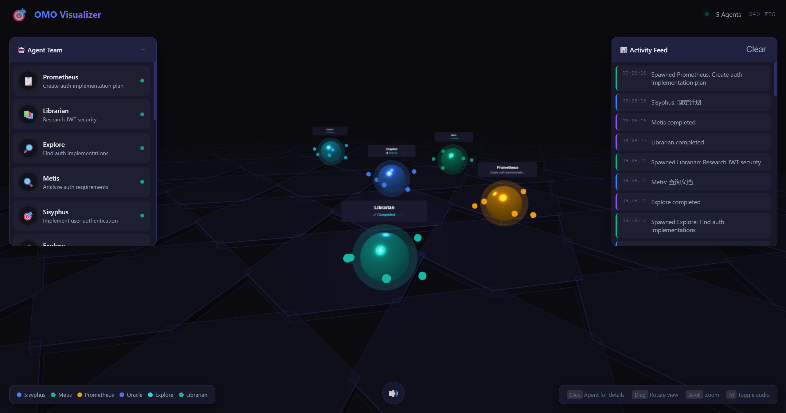
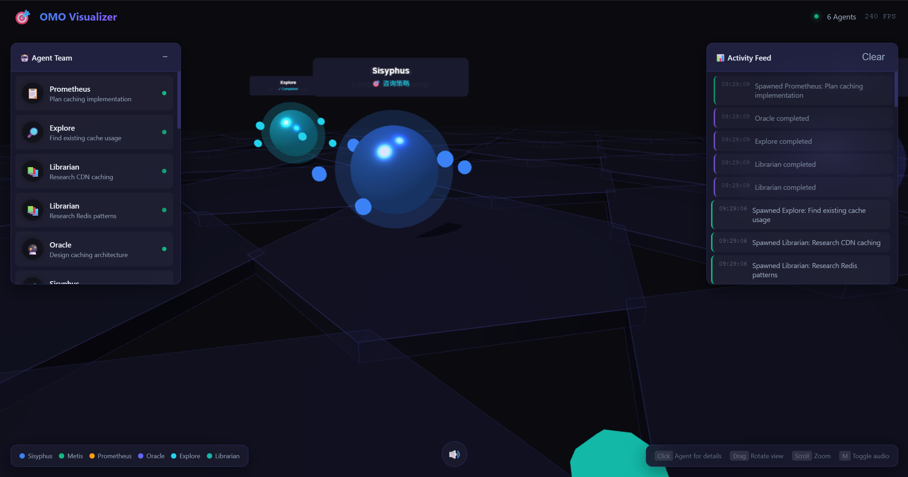

# OMO Visualizer

🎯 **Demonstrationstool für die Zusammenarbeit im Oh My Opencode Agent-Team**

> ⚠️ **Wichtiger Hinweis**: Dies ist ein **Demonstrations-/Prototyp-Tool**, kein Echtzeit-Überwachungssystem für die Produktion. Die aktuelle Version verwendet einen eingebauten Simulator, um voreingestellte Szenarien zu generieren und den Multi-Agent-Zusammenarbeits-Workflow zu demonstrieren. Es zielt darauf ab, Benutzern zu helfen, die Oh My Opencode Agent-Team-Architektur und Zusammenarbeitsmechanismen intuitiv zu verstehen.

Inspiriert von [vibecraft](https://github.com/Nearcyan/vibecraft) bietet dieses Tool eine immersive 3D-Visualisierungsschnittstelle, mit der Sie beobachten können, wie das Oh My Opencode Agent-Team bei der Erledigung von Aufgaben zusammenarbeitet.


## 📸 Screenshots

### Funktionsimplementierungsszenario
Mehrere Agents arbeiten bei einer Funktionsimplementierungsaufgabe zusammen: Sisyphus als Hauptkoordinator, Metis zur Analyse von Anforderungen, Explore zur Durchsuchung der Codebasis, Librarian zur Erforschung von JWT-Sicherheit und Prometheus zur Erstellung des Implementierungsplans.



### Architekturentscheidungsszenario
Sisyphus konsultiert Oracle für das Caching-Architekturdesign, mehrere Librarian erforschen Redis- und CDN-Caching-Lösungen parallel und demonstrieren den Kollaborationsprozess für komplexe Architekturentscheidungen.



## ✨ Funktionen

### 🎮 Primäre Schnittstelle - Agent-Übersichtspanel
- **Echtzeit-Agent-Liste**: Zeigt alle aktiven Agents und ihre aktuellen Aktionen an
- **Aktion + Thema Format**: z.B. "Codebasis durchsuchen: auth patterns", "Plan erstellen: API-Refactoring"
- **Farbkodierung**: Verschiedene Agent-Typen werden durch verschiedene Farben identifiziert
- **Statusanzeigen**: Zeigt den aktuellen Status des Agents an (aktiv/arbeitet/abgeschlossen)

### 🔍 Sekundäre Schnittstelle - Agent-Detail-Session-Popup
- **Klicken zum Öffnen**: Klicken Sie auf ein Agent-Symbol in der primären Schnittstelle, um ein detailliertes Fenster zu öffnen
- **Vollständige Session-Protokolle**: Betrachten Sie den Denkprozess des Agents, Tool-Aufrufe und Entscheidungsbegründungen
- **Statistiken**: Token-Nutzung, verarbeitete Dateien, Dauer, Anzahl der Sub-Agents
- **Dateiverfolgung**: Zeigt alle Dateien an, an denen der Agent gearbeitet hat

### 🎨 3D-Visualisierung
- **Hexagonales Gitter**: Hexagonaler Studioboden, inspiriert vom vibecraft-Stil
- **Agent-Entitäten**: Jeder Agent wird als leuchtende 3D-Kugel mit Partikelorbitalanimationen dargestellt
- **Räumliche Verteilung**: Verschiedene Agent-Typen haben unterschiedliche Verteilungsbereiche im 3D-Raum
- **Dynamische Labels**: Information-Labels, die über den Agents schweben

### 📊 Aktivitätsstream
- **Echtzeit-Protokolle**: Chronologisches Protokoll aller Systemereignisse und Agent-Aktionen, das rechts angezeigt wird
- **Kategorie-Indikatoren**: Verschiedene Ereignistypen werden durch verschiedene Farben unterschieden

### 🔊 Audio-Feedback
- **Spawn-Sound**: Einzigartiger Ton, wenn ein Agent erzeugt wird
- **Aktions-Sound**: Audio-Feedback, wenn ein Agent Aktionen ausführt
- **Abschluss-Sound**: Akkord-Prompt, wenn eine Aufgabe abgeschlossen ist

## 🎬 Anwendungsfälle

Obwohl es ein Demonstrationstool ist, bietet es in den folgenden Szenarien echten Wert:

### 💼 Externe Präsentationen
- **Technologie-Roadshows & Fundraising-Demos** — Intuitiv zeigen Sie Investoren die intelligenten Kollaborationsfähigkeiten des AI-Agent-Systems
- **Produktlaunches** — Dienen Sie als visuelles Highlight des Produkts und lassen Sie das Publikum "sehen", wie AI funktioniert
- **Kunden-POC-Demos** — Helfen Sie potenziellen Kunden, den Wert und die Funktionsweise von Multi-Agent-Systemen zu verstehen
- **Branchenkonferenz-Vorträge** — Dynamische visuelle Hilfe für technische Präsentationen, stärkere Wirkung als statische PowerPoint-Folien

### 👥 Interner Wert
- **Onboarding neuer Mitglieder** — Helfen Sie neuen Teammitgliedern, die Oh My Opencode Agent-Architektur und die Arbeitsteilungslogik schnell zu verstehen
- **Architekturdesign-Reviews** — Präsentieren Sie Multi-Agent-Kollaborationsdesigns visuell zur Teamdiskussion und Optimierung
- **Technologie-Sharing-Sessions** — Interner Wissenstransfer, der die interne Funktionsweise des AI-Systems demonstriert
- **Debugging-Verständnishilfe** — Helfen Sie Entwicklern, Ausführungsabläufe und Entscheidungspfade in komplexen Multi-Agent-Interaktionen zu verstehen

### 📚 Bildung & Outreach
- **Technische Blogs & Artikel-Illustrationen** — Machen Sie abstrakte Multi-Agent-Konzepte visuell und leicht verständlich
- **Open-Source-Projekt-Showcases** — Ziehen Sie mehr Entwickler und Mitwirkende an, um sich zu engagieren und zu partizipieren
- **Lehr- & Schulungsmaterialien** — Verwendung für den Unterricht von Kursen über Multi-Agent-Systemdesign, AI-Kollaborationsmechanismen usw.
- **Akademische Forschungspräsentationen** — Präsentation des Workflows und Entscheidungsprozesses der AI-Agent-Kollaboration

### 🏢 Marken- & Kulturaufbau
- **Firmenlobby-Displays** — Schleifenwiedergabe in Empfangs- oder Ausstellungsbereichen, um technische Fähigkeiten und Ingenieurskultur zu präsentieren
- **Social-Media-Inhalte** — Aufzeichnung von Demo-Videos für technologische Verbreitung auf Plattformen wie Twitter/X, LinkedIn
- **Recruitment-Marketing** — Präsentieren Sie Kandidaten die modernsten AI-Engineering-Praktiken des Unternehmens
- **Technologie-Markenaufbau** — Etablieren Sie ein "Transparentes AI"-Image und lassen Sie Benutzer/Kunden verstehen, wie das System für sie arbeitet

## 🚀 Schnellstart

### Von GitHub herunterladen

```bash
# Repository klonen
git clone https://github.com/mai-jingming95/OmO_Visualizer.git

# Zum Projektverzeichnis navigieren
cd OmO_Visualizer
```

### Abhängigkeiten installieren
```bash
npm install
```

### Server starten
```bash
npm run dev
```

### Auf die Visualisierungsschnittstelle zugreifen
Öffnen Sie Ihren Browser und besuchen Sie http://localhost:4004

## 🏗️ Systemarchitektur

### Agent-Typ-Zuordnung

| Agent | Farbe | Funktion |
|-------|-------|----------|
| **Sisyphus** | 🔵 Blue | Hauptkoordinator, verarbeitet Benutzeranfragen |
| **Metis** | 🟢 Emerald | Vorausplanungsberater, Risikoerkennung |
| **Prometheus** | 🟡 Amber | Planersteller |
| **Oracle** | 🟣 Indigo | Strategieberater, komplexe Architekturentscheidungen |
| **Explore** | 🔵 Cyan | Codebasis-Durchsuchung |
| **Librarian** | 🩵 Teal | Dokumentenforschung |

### Ereignissystem

```javascript
// Agent-Generierung
{ type: 'agent_spawn', data: { id, agentType, description, parentId } }

// Agent-Aktion
{ type: 'agent_action', data: { agentId, action, details } }

// Agent-Abschluss
{ type: 'agent_complete', data: { agentId, result, duration } }
```

## 🎮 Interaktionssteuerung

| Aktion | Funktion |
|--------|----------|
| **Agent klicken** | Detailliertes Session-Popup öffnen |
| **Ziehen** | 3D-Ansicht drehen |
| **Scrollen** | Ansicht zoomen |
| **M-Taste** | Audio umschalten |
| **ESC** | Popup schließen |

## 📁 Projektstruktur

```
├── server/
│   └── index.js          # WebSocket-Server und Simulationsdatengenerierung
├── public/
│   ├── index.html        # Hauptseite
│   ├── styles.css        # Stylesheet
│   └── app.js            # Frontend-Anwendungslogik
├── shared/
│   └── types.js          # Gemeinsame Typdefinitionen
└── package.json
```

## 🎭 Simulationsszenarien

Der Server enthält 4 eingebaute Kollaborationsszenarien:

1. **Funktionsimplementierung**
   - Sisyphus → Metis-Analyse → Explore-Suche → Librarian-Forschung → Prometheus-Planung → Implementierung

2. **Bugfix**
   - Sisyphus → Oracle-Konsultation → Paralleles Explore → Fix → Test

3. **Code-Refactoring**
   - Parallele mehrere Explore-Suchen → Batch-Refactoring → Build-Validierung

4. **Architekturentscheidung**
   - Oracle-Tiefenkonsultation → Parallele mehrere Librarian-Forschungen → Prometheus-Implementierungsplanerstellung

## 🔌 WebSocket API

### Mit Server verbinden
```javascript
const ws = new WebSocket('ws://localhost:4004');
```

### Ereignisse senden
```javascript
// Agent-Detailinformationen abrufen
ws.send(JSON.stringify({
  type: 'get_agent_details',
  data: { agentId: 'xxx' }
}));
```

### Ereignisse empfangen
```javascript
ws.onmessage = (event) => {
  const msg = JSON.parse(event.data);
  // Handle: agent_spawn, agent_action, agent_complete, system
};
```

## 🛠️ Benutzerdefinierte Integration

Um sich mit dem echten Oh My Opencode-System zu verbinden, ändern Sie `server/index.js`:

```javascript
// Ersetzen Sie den Simulator durch eine echte Ereignisquelle
// Zum Beispiel: Hören auf Oh My Opencode-Hook-Ausgaben
// Oder Integration in Agent-System-Callbacks

function onRealAgentSpawn(agentType, description) {
  broadcast({
    type: EVENT_TYPES.AGENT_SPAWN,
    data: { id: generateId(), agentType, description }
  });
}
```

## 📝 Lizenz

MIT-Lizenz — Inspiriert vom [vibecraft](https://github.com/Nearcyan/vibecraft)-Design

## 🙏 Danksagungen

- [vibecraft](https://github.com/Nearcyan/vibecraft) — Inspiration und Architekturreferenz
- [Oh My Opencode](https://github.com/code-yeongyu/oh-my-opencode) — Agent-System
- [Three.js](https://threejs.org/) — 3D-Rendering
- [Tone.js](https://tonejs.github.io/) — Audioverarbeitung
